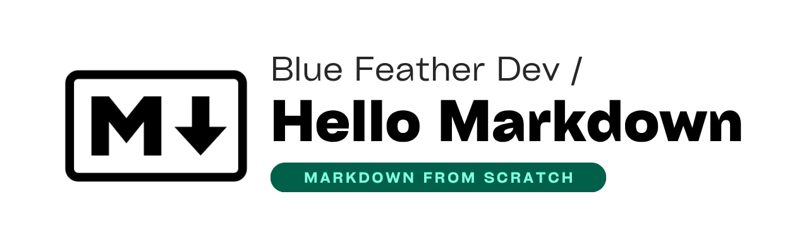

# Hello, Markdown!

Repository of notes, examples, and useful resources about **Markdown**, to strengthen my knowledge of Markdown and apply it in technical documentation such as `README.md`, GitHub projects, Obsidian, and more.

> This repository is licensed under the terms of the [Apache License 2.0](LICENSE).

## Learning sources

Here I collect the main sources I am using to learn Markdown:

- [Official Obsidian Guide](https://help.obsidian.md/)

- [Markdown Guide (complete and clear)](https://www.markdownguide.org/)
- [GitHub Writing Guide](https://docs.github.com/es/get-started/writing-on-github)

## Why learn Markdown

Markdown is simple, fast, and compatible with many platforms such as GitHub, Obsidian, VSCode, and blogs. Learning it well allows you to:

- Write clear and elegant documentation

- Keep notes organized and portable
- Link ideas and create your own knowledge system

## Repository goal

- Learn Markdown from basics to advanced

- Apply what I’ve learned in real projects
- Improve my documentation skills as a developer

> Made with '\u{2665}' (♥) by Jesús Domínguez [@bluefeatherdev](https://github.com/bluefeatherdev)
