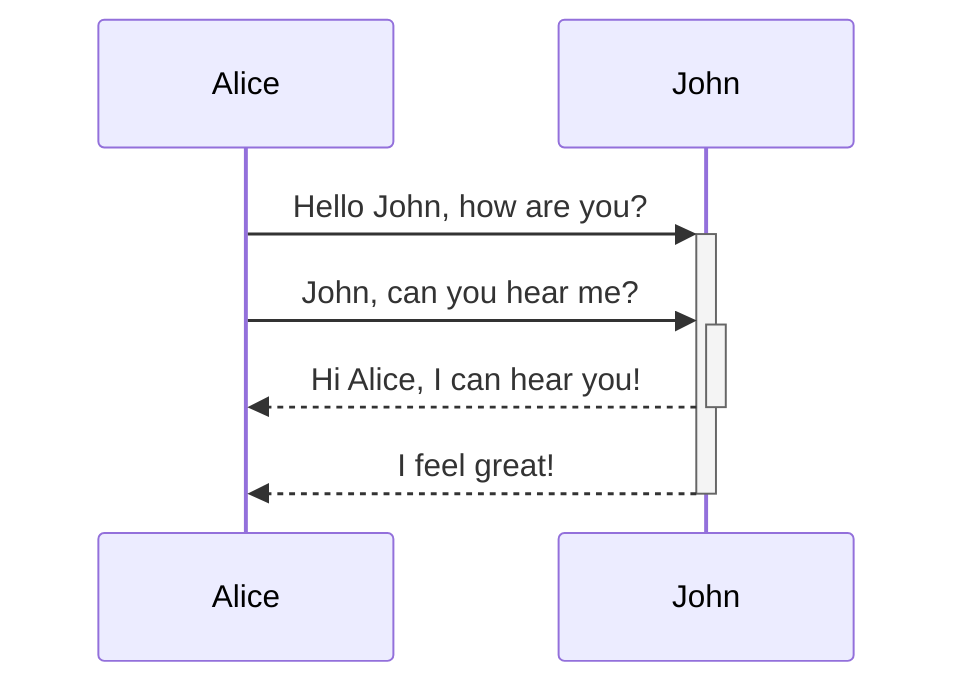
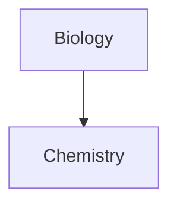

# Advanced formatting syntax

## Tables 

```markdown
| First name | Last name |
| ---------- | --------- |
| Max        | Planck    |
| Marie      | Curie     |
```
| First name | Last name |
| ---------- | --------- |
| Max        | Planck    |
| Marie      | Curie     |

```markdown
First name | Last name
-- | --
Max | Planck
Marie | Curie
```
First name | Last name
-- | --
Max | Planck
Marie | Curie

# Format content within a table

```markdown
First column | Second column
-- | --
[[Basic formatting syntax\|Markdown syntax]] | 
```
First column | Second column
-- | --
[[Basic formatting syntax\|Markdown syntax]] | 

```markdown
Left-aligned text | Center-aligned text | Right-aligned text
:-- | :--: | --:
Content | Content | Content
```
Left-aligned text | Center-aligned text | Right-aligned text
:-- | :--: | --:
Content | Content | Content

# Diagram





# Linking files in a diagram


# Math 

```markdown
$$
\begin{vmatrix}a & b\\
c & d
\end{vmatrix}=ad-bc
$$
```
$$
\begin{vmatrix}a & b\\
c & d
\end{vmatrix}=ad-bc
$$

```markdown
This is an inline math expression $e^{2i\pi} = 1$.
```
This is an inline math expression $e^{2i\pi} = 1$.
